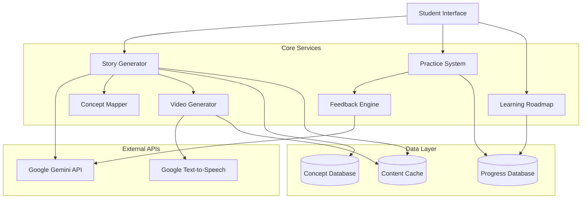

# Design Document: TECHTALES

## Overview

TECHTALES is an AI-powered educational platform that transforms abstract programming concepts into relatable learning experiences through story-based pedagogy. The system leverages Google Gemini API for intelligent content generation and Google Text-to-Speech for accessibility, creating a multi-modal learning environment that bridges conceptual understanding with practical coding skills.

The platform follows a three-phase learning cycle:
1. **Conceptual Understanding**: Students learn through AI-generated real-life stories
2. **Visual Reinforcement**: Stories are converted into narrated explainer videos
3. **Practical Application**: Students practice with coding problems and receive story-based feedback

## Architecture

### High-Level Architecture



### System Components

1. **Student Interface Layer**: Web-based interface for concept input, content consumption, and practice
2. **AI Services Layer**: Story generation, feedback generation, and content reasoning
3. **Content Generation Layer**: Video creation, narration, and visual representation
4. **Practice & Evaluation Layer**: Problem generation, solution evaluation, and progress tracking
5. **Data Persistence Layer**: Concept definitions, student progress, and content caching

### Technology Stack

- **AI/ML**: Google Gemini API (story generation, reasoning, feedback)
- **Text-to-Speech**: Google Text-to-Speech API (narration)
- **Backend**: Python/Node.js (API services)
- **Frontend**: React/Vue.js (student interface)
- **Database**: PostgreSQL (progress tracking), Redis (caching)
- **Video Processing**: FFmpeg (video generation from images and audio)

## Components and Interfaces

### Story Generator

**Purpose**: Generate educational stories that explain programming concepts through real-life scenarios.

**Interface**:
```python
class StoryGenerator:
    def generate_story(concept: str, difficulty: str) -> Story:
        """
        Generate a story for a programming concept.
        
        Args:
            concept: Programming concept name (e.g., "recursion", "if-else")
            difficulty: Difficulty level ("basic", "intermediate", "advanced")
            
        Returns:
            Story object containing narrative, mappings, and metadata
        """
        pass
    
    def validate_concept(concept: str) -> ValidationResult:
        """
        Validate if a concept is supported and suggest alternatives.
        
        Args:
            concept: User-provided concept name
            
        Returns:
            ValidationResult with status and suggestions
        """
        pass
```

**Story Structure**:
```python
class Story:
    concept: str                    # Programming concept being taught
    difficulty: str                 # Difficulty level
    narrative: str                  # The story text
    characters: List[Character]     # Story characters
    scenes: List[Scene]             # Story scenes/steps
    mappings: List[ConceptMapping]  # Links to programming constructs
    metadata: StoryMetadata         # Generation timestamp, version, etc.
```

**Implementation Details**:
- Uses Google Gemini API with carefully crafted prompts
- Maintains a concept taxonomy for validation
- Caches generated stories to reduce API calls
- Ensures stories are age-appropriate and culturally sensitive

### Video Generator

**Purpose**: Convert text stories into narrated explainer videos with visual representations.

**Interface**:
```python
class VideoGenerator:
    def create_video(story: Story) -> Video:
        """
        Create a narrated video from a story.
        
        Args:
            story: Story object to convert
            
        Returns:
            Video object with file path and metadata
        """
        pass
    
    def generate_narration(text: str) -> AudioFile:
        """
        Generate audio narration using text-to-speech.
        
        Args:
            text: Text to narrate
            
        Returns:
            AudioFile object with audio data
        """
        pass
```

**Video Generation Pipeline**:
1. Parse story into scenes
2. Generate visual representations for each scene (illustrations/diagrams)
3. Generate narration audio using Google TTS
4. Combine visuals and audio using FFmpeg
5. Add subtitles for accessibility
6. Cache generated video

**Visual Representation Strategy**:
- Use simple illustrations or diagrams
- Highlight key decision points in stories
- Show parallel story-to-code comparisons
- Use consistent visual language across videos

### Concept Mapper

**Purpose**: Create explicit mappings between story elements and programming constructs.

**Interface**:
```python
class ConceptMapper:
    def create_mappings(story: Story, code_example: str) -> List[Mapping]:
        """
        Create mappings between story elements and code.
        
        Args:
            story: The educational story
            code_example: Code syntax for the concept
            
        Returns:
            List of mappings linking story to code
        """
        pass
    
    def generate_code_example(concept: str, story: Story) -> str:
        """
        Generate code example based on story context.
        
        Args:
            concept: Programming concept
            story: The story to base code on
            
        Returns:
            Code example as string
        """
        pass
```

**Mapping Structure**:
```python
class ConceptMapping:
    story_element: str      # Element from the story (e.g., "security guard checks ID")
    code_construct: str     # Programming construct (e.g., "if condition")
    code_snippet: str       # Actual code (e.g., "if student.has_valid_id():")
    explanation: str        # How they relate
```

### Practice System

**Purpose**: Generate coding problems and evaluate student solutions.

**Interface**:
```python
class PracticeSystem:
    def generate_problem(concept: str, story: Story) -> Problem:
        """
        Generate a coding problem based on learned concept.
        
        Args:
            concept: Programming concept
            story: The story student learned from
            
        Returns:
            Problem object with description and test cases
        """
        pass
    
    def evaluate_solution(problem: Problem, solution: str) -> EvaluationResult:
        """
        Evaluate student's code solution.
        
        Args:
            problem: The problem being solved
            solution: Student's code
            
        Returns:
            EvaluationResult with correctness and feedback
        """
        pass
```

**Problem Structure**:
```python
class Problem:
    concept: str                # Related concept
    story_context: Story        # Original story
    description: str            # Problem statement
    test_cases: List[TestCase]  # Input/output pairs
    difficulty: str             # Problem difficulty
    hints: List[str]            # Progressive hints
```

**Evaluation Strategy**:
- Run solution against test cases
- Check for syntax errors
- Verify logical correctness
- Analyze code structure and style
- Generate feedback tied to story elements

### Feedback Engine

**Purpose**: Provide intelligent, story-based feedback on student mistakes.

**Interface**:
```python
class FeedbackEngine:
    def generate_feedback(
        problem: Problem,
        solution: str,
        error: EvaluationError
    ) -> Feedback:
        """
        Generate story-based feedback for incorrect solutions.
        
        Args:
            problem: The problem attempted
            solution: Student's incorrect code
            error: Details about what went wrong
            
        Returns:
            Feedback object with story-based explanation
        """
        pass
    
    def identify_conceptual_gap(solution: str, expected: str) -> ConceptGap:
        """
        Identify the conceptual misunderstanding.
        
        Args:
            solution: Student's code
            expected: Correct approach
            
        Returns:
            ConceptGap describing the misunderstanding
        """
        pass
```

**Feedback Structure**:
```python
class Feedback:
    error_type: str             # Type of error (logic, syntax, etc.)
    story_reference: str        # Reference to story element
    explanation: str            # Story-based explanation
    hint: str                   # Guidance without full solution
    related_concept: str        # Concept to review
```

**Feedback Generation Strategy**:
- Use Gemini API to analyze code and identify errors
- Map errors back to story elements
- Provide progressive hints rather than solutions
- Reference specific scenes or characters from the story
- Suggest prerequisite concepts if fundamental gaps exist

### Learning Roadmap

**Purpose**: Suggest personalized learning paths based on student progress and performance.

**Interface**:
```python
class LearningRoadmap:
    def suggest_next_concept(student_id: str) -> ConceptSuggestion:
        """
        Suggest the next concept for a student to learn.
        
        Args:
            student_id: Unique student identifier
            
        Returns:
            ConceptSuggestion with recommended concept and reasoning
        """
        pass
    
    def get_learning_path(student_id: str) -> LearningPath:
        """
        Get personalized learning path for student.
        
        Args:
            student_id: Unique student identifier
            
        Returns:
            LearningPath with ordered concepts and progress
        """
        pass
    
    def identify_prerequisites(concept: str) -> List[str]:
        """
        Identify prerequisite concepts for a given concept.
        
        Args:
            concept: Target concept
            
        Returns:
            List of prerequisite concept names
        """
        pass
```

**Roadmap Algorithm**:
1. Analyze student's completed concepts and performance
2. Identify knowledge gaps based on practice results
3. Consider concept dependencies (prerequisites)
4. Suggest next concept balancing challenge and achievability
5. Adapt path based on student's learning velocity

**Concept Dependency Graph**:
```
Basic Level:
  - Variables → Data Types → Operators
  - If-Else → Loops (While) → Loops (For)
  - Functions → Parameters → Return Values

Intermediate Level:
  - Arrays → Array Operations → Searching
  - Objects → Object Methods → Encapsulation
  - Recursion (requires: Functions, Base Cases)

Advanced Level:
  - Backtracking (requires: Recursion, Arrays)
  - Dynamic Programming (requires: Recursion, Arrays)
  - Nested Loops (requires: Loops, Arrays)
```

## Data Models

### Student Progress

```python
class StudentProgress:
    student_id: str
    completed_concepts: List[CompletedConcept]
    current_concept: str
    learning_path: List[str]
    performance_metrics: PerformanceMetrics
    created_at: datetime
    updated_at: datetime

class CompletedConcept:
    concept: str
    completed_at: datetime
    story_id: str
    practice_attempts: int
    practice_success_rate: float
    time_spent: int  # seconds
```

### Concept Definition

```python
class ConceptDefinition:
    concept_id: str
    name: str
    difficulty: str  # "basic", "intermediate", "advanced"
    category: str    # "control-flow", "data-structures", "algorithms"
    prerequisites: List[str]
    description: str
    keywords: List[str]
    example_use_cases: List[str]
```

### Generated Content

```python
class GeneratedContent:
    content_id: str
    concept: str
    content_type: str  # "story", "video", "problem"
    content_data: dict  # Flexible storage for different content types
    created_at: datetime
    version: int
    cache_expiry: datetime
```

## Correctness Properties

*A property is a characteristic or behavior that should hold true across all valid executions of a system—essentially, a formal statement about what the system should do. Properties serve as the bridge between human-readable specifications and machine-verifiable correctness guarantees.*


### Property Reflection

After analyzing all acceptance criteria, I've identified several areas where properties can be consolidated:

**Story Generation Properties**:
- Properties 1.1 (generates story for valid concept) and 1.2 (story has mappings) can be combined into a single comprehensive property that verifies story generation produces complete, valid stories with all required elements.
- Property 1.4 (supports all difficulty levels) is implicitly tested by the combined property when we generate concepts across all difficulty levels.

**Video Generation Properties**:
- Properties 2.1 (converts story to video) and 2.2 (includes narration) can be combined into a single property that verifies video generation produces complete videos with both visual and audio components.

**Concept Mapping Properties**:
- Properties 3.1 (shows mappings), 3.2 (includes code syntax), and 3.3 (side-by-side format) can be combined into a single property that verifies mappings contain all required elements in the proper structure.

**Feedback Properties**:
- Properties 4.3 (feedback uses story framework), 4.4 (ties to story elements), 5.2 (references story parts), and 5.3 (uses story framework) are all testing the same core behavior: feedback must reference the original story. These can be combined into one comprehensive property.

**Progress Tracking Properties**:
- Properties 10.1 (tracks completions), 10.2 (records performance), and 10.4 (maintains history) are all testing data persistence. These can be combined into a single property about progress data persistence.

### Correctness Properties

Property 1: Story Generation Completeness
*For any* valid programming concept and difficulty level, generating a story should produce a Story object containing a non-empty narrative, at least one character, at least one scene, and at least one concept mapping.
**Validates: Requirements 1.1, 1.2, 1.4**

Property 2: Invalid Concept Handling
*For any* invalid or ambiguous concept input, the Story_Generator should return a validation error with suggestions rather than generating a story.
**Validates: Requirements 1.3, 7.3**

Property 3: Concept Validation
*For any* concept input, the validation function should correctly identify whether the concept is supported and return appropriate status.
**Validates: Requirements 7.2**

Property 4: Video Generation Completeness
*For any* valid Story object, generating a video should produce a Video object with a valid file path, non-zero file size, and both video and audio tracks.
**Validates: Requirements 2.1, 2.2, 2.5**

Property 5: Concept Mapping Structure
*For any* story and code example, creating mappings should produce a list where each mapping contains a non-empty story element, code construct, code snippet, and explanation.
**Validates: Requirements 3.1, 3.2, 3.3**

Property 6: Difficulty Level Support
*For any* difficulty level (basic, intermediate, advanced), the Concept_Mapper should successfully generate mappings for concepts at that level.
**Validates: Requirements 3.5**

Property 7: Problem Generation
*For any* completed concept and story, the Practice_System should generate a Problem object containing a description, at least one test case, and a reference to the story context.
**Validates: Requirements 4.1**

Property 8: Solution Evaluation Correctness
*For any* problem with known correct and incorrect solutions, the Practice_System should evaluate correct solutions as passing and incorrect solutions as failing.
**Validates: Requirements 4.2**

Property 9: Story-Based Feedback
*For any* incorrect solution, the Feedback_Engine should generate feedback that contains at least one reference to a story element from the original story.
**Validates: Requirements 4.3, 4.4, 5.2, 5.3**

Property 10: Success Confirmation
*For any* correct solution submission, the Practice_System should return a success confirmation and at least one next step suggestion.
**Validates: Requirements 4.5**

Property 11: Conceptual Gap Identification
*For any* incorrect solution, the Feedback_Engine should identify at least one conceptual gap in the ConceptGap object.
**Validates: Requirements 5.1**

Property 12: Error Prioritization
*For any* solution with multiple known errors, the Feedback_Engine should return feedback addressing the most fundamental error first (based on concept dependency order).
**Validates: Requirements 5.5**

Property 13: Next Concept Suggestion
*For any* student who has completed at least one concept, the Learning_Roadmap should suggest a next concept that either builds on completed concepts or addresses identified gaps.
**Validates: Requirements 6.1**

Property 14: Personalized Suggestions
*For any* two students with different progress profiles (different completed concepts and performance), the Learning_Roadmap should generate different next concept suggestions.
**Validates: Requirements 6.2, 6.5**

Property 15: Difficulty Progression
*For any* learning path generated by the Learning_Roadmap, concepts should be ordered such that no concept appears before its prerequisites.
**Validates: Requirements 6.3**

Property 16: Prerequisite Recommendation
*For any* student who fails a concept's practice problems multiple times, the Learning_Roadmap should recommend at least one prerequisite concept if prerequisites exist.
**Validates: Requirements 6.4**

Property 17: Concept Categorization
*For any* list of supported concepts displayed by the System, concepts should be grouped by their difficulty level with correct categorization.
**Validates: Requirements 7.5**

Property 18: API Error Handling
*For any* simulated API failure (Gemini or TTS), the System should handle the error gracefully without crashing and return an error message to the user.
**Validates: Requirements 8.4**

Property 19: Rate Limit Management
*For any* sequence of API calls, the System should not exceed the configured rate limit for the API service.
**Validates: Requirements 8.5**

Property 20: Progress Persistence
*For any* student activity (completing a concept, submitting a practice solution), the System should persist the activity to the database and retrieve it correctly on subsequent queries.
**Validates: Requirements 10.1, 10.2, 10.4**

Property 21: Progress Display Completeness
*For any* student with at least one completed concept, viewing progress should display both the completed concepts list and at least one recommended next concept.
**Validates: Requirements 10.3, 10.5**

## Error Handling

### API Failures

**Google Gemini API Errors**:
- Network timeouts: Retry with exponential backoff (max 3 attempts)
- Rate limit exceeded: Queue request and retry after rate limit window
- Invalid request: Log error, return user-friendly message
- Service unavailable: Use cached content if available, otherwise inform user

**Google Text-to-Speech Errors**:
- Network timeouts: Retry with exponential backoff
- Quota exceeded: Queue video generation, process when quota resets
- Invalid text input: Sanitize input and retry
- Service unavailable: Inform user, allow text-only story viewing

### User Input Errors

**Invalid Concept Input**:
- Empty input: Prompt user to enter a concept
- Unrecognized concept: Suggest similar concepts using fuzzy matching
- Ambiguous concept: Present disambiguation options

**Invalid Code Submission**:
- Syntax errors: Highlight error location, provide syntax guidance
- Runtime errors: Capture error, explain in story context
- Timeout: Inform user, suggest optimization

### Data Persistence Errors

**Database Connection Failures**:
- Use connection pooling with automatic reconnection
- Cache recent data in Redis for read operations
- Queue write operations for retry

**Cache Misses**:
- Regenerate content on cache miss
- Update cache with new content
- Log cache miss rate for monitoring

### Content Generation Errors

**Story Generation Failures**:
- Validate story structure before returning
- Retry generation with modified prompt if validation fails
- Fall back to template-based story if AI generation fails repeatedly

**Video Generation Failures**:
- Validate video file after generation
- Retry with different encoding settings if validation fails
- Provide story-only view if video generation fails

## Testing Strategy

### Dual Testing Approach

TECHTALES will employ both unit testing and property-based testing to ensure comprehensive coverage:

**Unit Tests**: Focus on specific examples, edge cases, and integration points
- Test specific concept examples (e.g., "if-else" generates expected story structure)
- Test edge cases (empty inputs, malformed data, boundary conditions)
- Test API integration points with mocked responses
- Test error handling for specific failure scenarios
- Test UI components and user interactions

**Property-Based Tests**: Verify universal properties across all inputs
- Test that story generation works for all valid concepts
- Test that feedback always references story elements
- Test that learning paths maintain prerequisite ordering
- Test that progress tracking persists all activities
- Generate random inputs to discover edge cases

### Property-Based Testing Configuration

**Testing Library**: Use `hypothesis` (Python) or `fast-check` (JavaScript/TypeScript) for property-based testing

**Test Configuration**:
- Minimum 100 iterations per property test
- Each test tagged with: `Feature: techtales, Property {N}: {property_text}`
- Use custom generators for domain objects (Story, Problem, Student, etc.)
- Seed random generation for reproducibility

**Example Property Test Structure**:
```python
from hypothesis import given, strategies as st
import pytest

@given(
    concept=st.sampled_from(['if-else', 'loops', 'recursion', 'arrays']),
    difficulty=st.sampled_from(['basic', 'intermediate', 'advanced'])
)
@pytest.mark.property_test
def test_story_generation_completeness(concept, difficulty):
    """
    Feature: techtales, Property 1: Story Generation Completeness
    For any valid programming concept and difficulty level, generating a story 
    should produce a Story object containing a non-empty narrative, at least 
    one character, at least one scene, and at least one concept mapping.
    """
    story = story_generator.generate_story(concept, difficulty)
    
    assert story is not None
    assert len(story.narrative) > 0
    assert len(story.characters) >= 1
    assert len(story.scenes) >= 1
    assert len(story.mappings) >= 1
```

### Testing Coverage Goals

- **Unit Test Coverage**: Minimum 80% code coverage
- **Property Test Coverage**: All 21 correctness properties implemented
- **Integration Test Coverage**: All API integrations and component interactions
- **End-to-End Test Coverage**: Critical user flows (concept learning, practice, progress tracking)

### Test Data Strategy

**Concept Test Data**:
- Maintain a test concept database with examples at each difficulty level
- Include edge cases (very short names, special characters, similar names)

**Story Test Data**:
- Generate synthetic stories for testing
- Use cached real stories for integration tests
- Test with various story lengths and complexities

**Student Test Data**:
- Create test student profiles with different progress states
- Include edge cases (no progress, all concepts completed, mixed performance)

**Performance Testing**:
- Load testing: Simulate 100+ concurrent users
- API rate limit testing: Verify graceful handling of rate limits
- Video generation performance: Ensure videos generate within acceptable time (< 30 seconds)
- Database query performance: Ensure queries complete within 100ms

### Continuous Integration

- Run unit tests on every commit
- Run property tests on every pull request
- Run integration tests nightly
- Run end-to-end tests before deployment
- Monitor test execution time and flakiness
